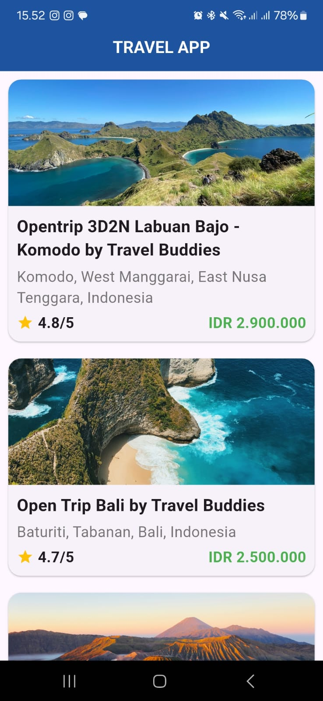

# ✈️ Travel App

A mobile travel app built with Flutter that lets users explore, book, and review curated open trips across Indonesia — from the iconic Komodo Islands to the serene beaches of Bali and the volcanic views of Bromo.

---

## 🧭 Features

- 📍 Browse available open trips
- 🖼 View photos, itinerary, and included/excluded facilities
- 📅 Select visit dates or custom date ranges
- 🧾 Dynamic total price calculation
- 🧑‍🤝‍🧑 View traveler reviews
- 🗺️ Interactive itineraries
- 🖼️ Offline & online images support

---

## 🛠️ Tech Stack

- **Flutter** (stateful widgets, layout system)
- **Dart** language
- **Local mock data** (for trips, reviews, itinerary)
- **Date management** with `intl` package

---

## 📂 Project Structure
travel_app/
├── assets/
├── lib/

 

# App images


---

## 🚀 Getting Started

### 1. Clone the Repo
```bash
git clone https://github.com/your-username/travel_app.git
cd travel_app
```
### 2. Get Packages
```
flutter pub get
```
### 3. Run the App
```
flutter run
```
